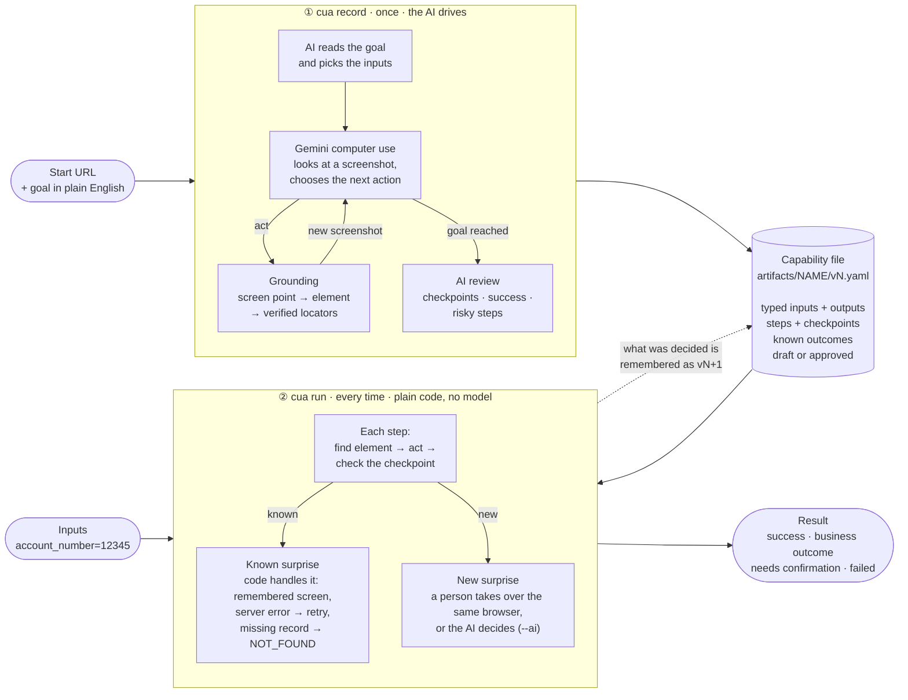

# cua: teach a web app once, replay it forever

Many business apps have no API: bank back offices, admin consoles, vendor portals. `cua` automates them through their
normal web UI, on **any website**:

1. **Record once, with AI.** Give it a URL and a goal in plain English. Gemini computer use does the task in a real browser.
2. **Save a capability file.** What worked becomes a small YAML file with typed inputs and outputs. You can read it,
   diff it and review it like code.
3. **Replay with plain code.** `cua run` repeats the task with new inputs. There is no model involved, so it is fast,
   free and the same every time.
4. **Learn from surprises.** When a replay meets a screen it has never seen, a person takes over the same browser, or
   the AI decides if you pass `--ai`. The file remembers the answer, so next time plain code handles it.

Design write-up: [REPORT.md](REPORT.md) · Proof from real runs: [evidence/](evidence/README.md)

## How it works



Guardrails apply to every action, whether the AI or a person takes it: a domain allowlist, approval before risky steps,
and secrets that are never saved.

## Quick start

Needs Python 3.11+ and [uv](https://docs.astral.sh/uv/).

```bash
uv sync
uv run playwright install chromium
cp .env.example .env        # then add your GEMINI_API_KEY
```

`.env` holds the Gemini key and the secrets your goals use. `.env.example` already has the public demo passwords:
`PASSWORD` for ParaBank's customer `john`, `SAUCE_PASSWORD` for SauceDemo.

**No Gemini key?** Replay needs none. Copy the capabilities recorded for the evidence with
`cp -R evidence/artifacts artifacts`, then run steps 0 and 3 of Demo 1.

## The five commands

```bash
cua record URL "GOAL"      # learn a new capability (Gemini drives a visible browser)
cua run NAME key=value …   # replay it with new inputs, no model
cua list                   # all capabilities: version, status, last result
cua show NAME              # a plain-English card: what it needs, returns, does, and what can go wrong
cua approve NAME           # draft → approved: lets risky steps (transfer, pay, submit) run unattended
```

Run them as `uv run cua …`, or activate the virtualenv first.

**Writing a goal:** use plain English. The AI decides which values are inputs, and `cua record` prints their names.
The only thing you mark is a **secret**, written `{name:secret}`. The model only ever sees a placeholder. The real
value is read from `NAME` in `.env` (or asked for once), typed at the keyboard, and never saved.

## Demo 1: a bank (live ParaBank, about 3 minutes)

[ParaBank](https://parabank.parasoft.com/parabank/) is a public demo bank. It wipes its data now and then. Its
built-in customer `john` (password `demo`) always comes back, but his account numbers change, so step 0 looks up his
current ones. If john is broken, register a customer on ParaBank's Register page and use that username and account
number instead.

```bash
# 0. Pick one of john's current accounts (they change when ParaBank resets).
ACCT=$(uv run python scripts/parabank_accounts.py | cut -d' ' -f1); echo $ACCT

# 1. Learn it. A browser opens; the bar at the bottom shows who is in control.
uv run cua record https://parabank.parasoft.com/parabank/index.htm \
  "Log in as john with {password:secret}, open account $ACCT and read its balance" \
  --name parabank-account-balance
#   ✔ Learned 'parabank-account-balance' v1 (6 steps)
#     AI read the goal: password (secret), username (string), account_number (string)

# 2. Read it.
uv run cua show parabank-account-balance

# 3. Replay it. Use the input names printed in step 1.
uv run cua run parabank-account-balance username=john account_number=$ACCT    # ✔ Success: balance: …
uv run cua run parabank-account-balance username=john account_number=99999   # ● NOT_FOUND: an answer, not a crash
uv run cua run parabank-account-balance username=john                        # ✖ missing input, before any browser opens

# 4. Break it on purpose to see how surprises are handled.
uv run cua run parabank-account-balance username=john account_number=$ACCT --inject modal@s5               # asks you
uv run cua run parabank-account-balance username=john account_number=$ACCT --inject expire_session@s5 --ai  # the AI decides
uv run cua run parabank-account-balance username=john account_number=$ACCT --inject http500@s5             # code retries
```

When the injected pop-up appears, the bar turns red (**⚠️ Needs you**). Click **Take over**, close the pop-up, then
choose **This screen means… → "A pop-up I closed" → Save**. The run finishes, and every later run closes that pop-up
by itself.

**Risky steps** such as a transfer pause for **Approve / Deny** while recording. On replay, a **draft** capability stops
before them with `needs_confirmation`. After `cua approve`, they run unattended.

## Demo 2: any other website (live SauceDemo shop)

Nothing in `cua` is specific to banks. The same command learns a shop checkout:

```bash
uv run cua record https://www.saucedemo.com/ \
  "Log in as standard_user with {sauce_password:secret}, add the Sauce Labs Backpack to the cart, check out as Ada Lovelace with postal code 10001, reach the checkout overview page and read the item total" \
  --name saucedemo-checkout

uv run cua run saucedemo-checkout username=standard_user "product_name=Sauce Labs Bike Light" \
  first_name=Grace last_name=Hopper postal_code=94016
#   ✔ Success: item_total: 9.99
```

"Add to cart" is saved as *the button in the row for `{product_name}`*, so the same file works for any product.

## Who decides what

The AI makes the judgment calls. Code carries them out and keeps the guarantees. Code never second-guesses the AI.

| | The AI decides | Code does |
|---|---|---|
| **Recording** | which values in the goal are inputs · every action · which steps are risky · each step's checkpoint and the success condition | turns each click into verified locators · acts through them · saves the file |
| **Replay** | nothing, by default · with `--ai`: what a new screen means, and where a moved element went | runs the steps · handles known screens, server errors and missing records · asks a person about anything new |
| **Always** | | domain allowlist · approval before risky steps · never retries a risky step · attempt limits · keeps secrets and personal data out of files |

People decide approvals, CAPTCHAs (never solved automatically), and new screens during replay unless `--ai` is on.

## When a replay meets something unexpected

| What happens | What `cua` does | Decided by |
|---|---|---|
| The page tries to leave the allowed domains | stops: `failed POLICY_BLOCKED` | code |
| A screen the file already knows (e.g. a pop-up) | handles it as remembered: close it, retry, start over, return an answer, or stop | code |
| Server error (HTTP 5xx) | waits (2 s, then 4 s) and reloads | code |
| The requested record doesn't exist (account 99999) | returns `business_outcome NOT_FOUND` | code |
| A risky step on a draft capability | stops before it: `needs_confirmation`, nothing submitted | code |
| Anything new (e.g. the first "wrong password" error) | a person takes over the same browser and labels the screen, or the AI decides with `--ai`; saved as the next version | person or AI |
| Anything new, nobody watching (`--headless`, or no answer within 5 minutes) | `failed UNKNOWN_STATE`, with a screenshot and a page snapshot | code |

Every run writes `runs/<id>/`: a redacted event log, screenshots, and `result.json`.

## What works where

- **Works on any site:** plain HTML and single-page apps, frames and iframes, shadow DOM, pop-ups and new tabs,
  dropdowns, hover menus, double-click, lists and tables ("the Edit button in the row for {id}"), and logins,
  including SSO on another domain with `--allow`.
- **A person steps in:** CAPTCHAs and bot walls (never solved, by design).
- **Not supported yet:** file uploads and drag-and-drop.
- **Fragile:** apps drawn on a canvas fall back to screen coordinates, and every such step is flagged as drift.

## Tests (no network, no API key)

```bash
uv run pytest     # 33 tests, a few minutes
```

The tests drive the real recorder and replayer against a local "legacy" site in `tests/site/`: table layouts, no ids,
per-row buttons, late-loading values, a cookie session, a dropdown and a hover menu. Scripted stand-ins play the AI's
part. They cover every outcome class, the `--ai` decisions being remembered, a human takeover, Gemini's safety
approve/deny, the approval gate, and a secret that never reaches disk. No test calls the real model.

To regenerate `evidence/` against the live sites: `./scripts/make_evidence.sh`.

## Options you rarely need

| Flag | Command | Meaning |
|------|---------|---------|
| `--name` | record | capability name (default: suggested by the model) |
| `--allow DOMAIN` | record | also allow another domain, e.g. an SSO login (repeatable). By default only the start site and its subdomains are allowed |
| `--model` | record | Gemini model (default `gemini-3.8-flash`) |
| `--max-steps` | record | model turn budget (default 40) |
| `--timeout` | record | seconds before the recording gives up and saves nothing (default 600) |
| `--version N` | run, show | use a specific version (default: latest) |
| `--ai` | run | let the AI handle a new screen or a moved element instead of a person |
| `--inject FAULT@STEP` | run | simulate `slow`, `http500`, `expire_session` or `modal` before a step (repeatable) |
| `--json` | run | print the full result contract, for other programs and agents |
| `--headless` | record, run | no visible browser, so nobody can be asked: what needs a person fails with evidence |
| `--by NAME` | approve | the reviewer recorded in the history (default: your OS user) |

`cua run` exits with `0` for success or a business outcome, `2` for needs confirmation, and `1` for failure.

## Project layout

```
cua/cli.py         the five commands
cua/agent.py       recording: the Gemini loop and the recorder (pixels → verified locators)
cua/assist.py      the AI's other decisions: goal inputs, review, new screens, moved elements
cua/replay.py      replay: plain code; new screens go to a person, or to the AI with --ai
cua/artifact.py    the capability file schema (Pydantic) and versioned YAML storage
cua/surface.py     the browser seam (WebSurface = Playwright)
cua/grounding.js   in the page: point → element → locators, the control bar, capturing human actions
cua/handoff.py     who is in control: escalation and hand-back
cua/policy.py      allowlist and redaction
cua/evidence.py    per-run log, screenshots and result
artifacts/         capability files, one YAML per version (commit these)
runs/              per-run evidence (git-ignored)
```
