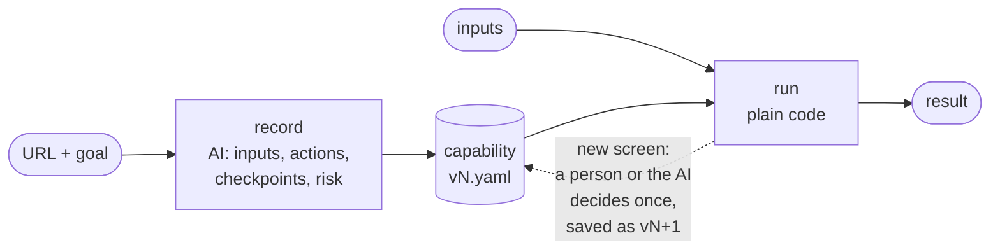
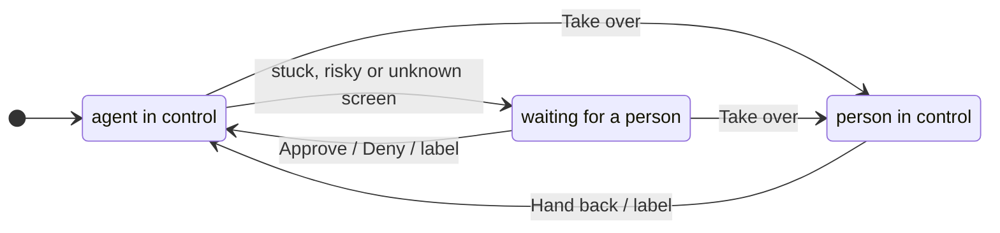

# Design report

**The idea in one line: the model discovers once, the file remembers, replay is plain code.**

Gemini works out a task on the live UI and makes the judgment calls a recording needs. The result is a small, typed,
versioned YAML capability. `cua run` replays it with no model. Anything new it meets is decided once, by a person or
(with `--ai`) by the AI, and remembered in the next version. The system is about 2,200 lines of Python and JavaScript
in one process, with four dependencies. `evidence/` shows it working on a bank (ParaBank) and a shop (SauceDemo).

## 1. Architecture



| Decision | Why |
|---|---|
| **The model sees only pixels; replay uses the DOM.** At each model action, `grounding.js` finds the element under the point (through iframes and shadow DOM) and builds a ladder of locators. The action runs through that locator, not the coordinate. | The brief says not to assume a clean DOM, so the model works from screenshots. The file only contains locators that actually worked. |
| **The AI decides, code executes.** The AI picks the inputs, every action, each checkpoint, the success condition and the risky steps. Its answers are applied as given. | Judgment is what models are good at. Guarantees (allowlist, approval, redaction, limits) belong in code that never changes its mind. |
| **Replay is deterministic by default.** `--ai` is opt-in and only for the unexpected. | The same inputs give the same steps, at no model cost. |
| **A CLI plus a control bar injected into the page.** No server, no database. | Capabilities are files you can diff, review and commit. |
| **Linear steps plus a list of known outcomes**, not a state graph. | Easy to read. Error knowledge grows in one place. |

**Targets.** ParaBank (legacy server-rendered tables, `;jsessionid` URLs, real 502s, a real transfer), SauceDemo
(lists, per-row buttons, a multi-page checkout), and a local fixture site for offline tests.
**Trade-off:** replay needs a DOM or an accessibility tree. Canvas-only apps fall back to a coordinate locator, which
is reported as drift every time it is used.

## 2. Artifact schema

One Pydantic-validated YAML file per version, `artifacts/<name>/v<N>.yaml`. It reads top to bottom as
*contract → policy → steps → known outcomes → proof → history*:

```yaml
capability: {id, version, status: draft|approved, description: "…open account {account_number}…", start_url, surface: web}
inputs:   {username: {type: string}, password: {type: secret}, account_number: {type: string}}   # chosen by the AI
outputs:  {balance: {type: money, sensitive: false}}         # sensitive outputs are stored as [sensitive]
policy:   {allowed_domains: [parabank.parasoft.com], allowed_actions: [navigate, click, type, select, …]}
steps:
- id: s5
  intent: Click account {{account_number}} to open it          # the model's own reason
  action: click
  target: {description: 'link "{{account_number}}"', locators: [{by: role, role: link, value: "{{account_number}}"}, …]}
  risk: safe                                                   # risky → needs approval; risk_reason says why
  expect: {url_contains: /parabank/activity.htm, text_visible: Account Details}   # the checkpoint
outcomes:                                                      # what a screen means, as decided by a person or the AI
- {id: system_notice, kind: recoverable, when: {text_visible: System notice}, recover: {action: dismiss, target: …}, source: ai}
success: [{url_contains: …, text_visible: Account Details}]    # and every output must be read
provenance: {model, discovery_run, history: [{version, change, by, at}]}
```

- **A contract first.** Typed inputs and outputs tell a calling program what to pass and what it gets back. Inputs are
  checked before a browser opens. Outputs are converted to their type (`$1,229.10` → `1229.1`).
- **Inputs come from the goal.** The AI reads "open account 12345" and decides `account_number` is an input. Code then
  replaces every occurrence of `12345` (typed text, link text, URLs) with `{{account_number}}`.
- **Secrets never reach the model.** The user marks them as `{password:secret}`. The model types the placeholder, and
  the real value is substituted at the keyboard.
- **A ladder of locators**, tried in order: row → role and name → label → placeholder → text → `near_text` (the input
  next to the text "Username", often the only handle in old id-less tables) → css → screen point. A rung is kept only if,
  at record time, it matches **exactly one element, the one that was clicked**. Targets that depend on an input keep only
  parameterized rungs, so a fallback can never pick another customer's record. The same rule records "Add to cart" as
  *the button in the row for `{{product_name}}`*.
- **Versioned.** Every change writes a new version, resets its status to `draft`, and adds a line to `history`.

## 3. Determinism & error handling

**Each step runs the same fixed sequence:** close known pop-ups → approval gate → find the element (first ladder rung
that matches exactly one element, waiting up to 10 s) → act → check the checkpoint. Waits are on conditions. The only
fixed pause is half a second after an action that can navigate. Same inputs, same steps, no model.

**When a step misses, code handles it in this order:**

| # | Detected by | Response |
|---|---|---|
| 1 | navigation outside the allowlist | stop: `failed POLICY_BLOCKED` |
| 2 | a known `outcome` matches the screen | as remembered: return a business outcome · close / retry / start over · stop |
| 3 | HTTP 5xx | recoverable: wait 2 s, then 4 s, and reload |
| 4 | **an input's element is missing from a page that passed its checkpoint** | `business_outcome NOT_FOUND` ("no match for account_number=99999") |
| 5 | anything else | a person decides (§5), or `failed UNKNOWN_STATE` with evidence. With `--ai`, the AI first re-finds a moved element or decides what the screen means |

Row 4 turns "no such account" into **an answer instead of a crash**, with no per-site configuration. Whatever a person
or the AI decides in row 5 becomes a row 2 outcome in the next version. Every recovery has a limit, after which the
run fails with `RECOVERY_EXHAUSTED`.

**The result every caller gets:**
- `status`: `success` | `business_outcome` | `needs_confirmation` | `failed`
- `code`, `message`, `outputs`
- on failure: `failed_step`, `expected`, and `observed` (URL, heading, text, HTTP status)
- `recoveries`, `locator_fallbacks` (drift), `ai_decisions`, `human_actions`, `learned`
- `evidence`: a screenshot, the page's accessibility snapshot, and the event log

`evidence/` shows every class on the live sites, including a real ParaBank 502 outage, `NOT_FOUND` on both sites, and a
validation error (a rejected password) that a person labels once and code returns from then on.

## 4. Heterogeneity & multi-tenant

**One seam.** The recorder and replayer only talk to a `Surface`, the one place that knows about browsers:
`open, screenshot, ground(x, y), focused, resolve(target), perform(action), check(condition), texts, close`.
The schema does not depend on it, because role, name, label and text exist in every accessibility API.

| Surface | How it fits |
|---|---|
| Legacy web | works today: grounding goes through frames and framesets, and `near_text` handles label-less tables |
| Desktop app | a `DesktopSurface` using Gemini's desktop environment and UI Automation / AX to build the same ladder (`AutomationId` takes the css rung's place) |
| Citrix or canvas | text found by OCR plus the screen-point rung, always reported as drift |

**Multi-tenant reuse.** Record a **base capability once per vendor product and version** (e.g.
`fis-corebank@2024.2/get-balance`) on a reference tenant. Each tenant gets a **small overlay** (a JSON merge-patch) with
only what differs: `start_url`, allowed domains, renamed labels ("Member #" vs "Member ID"), and extra outcomes. The
effective capability is base + overlay, so a fix to the base reaches every tenant. The ordered ladder already absorbs
many small differences with no overlay at all.

**Drift.** Every result reports `locator_fallbacks` and classified misses. Counted per capability, tenant and version,
a rising rate tells you to update the tenant's overlay, re-record that tenant, or publish a new base. Outcomes seen on
many tenants move into the base. The per-run data exists today; the counting and dashboards are not built (§7).

## 5. Escalation & handoff

**How "stuck" is detected:**

| While recording | During replay |
|---|---|
| the model calls `request_human` (e.g. a CAPTCHA, which is never solved automatically) | a screen no rule explains |
| three turns with no visible change | a risky step on a draft capability |
| the model asks a question instead of acting | recoveries used up |
| Gemini flags an action as risky (`safety_decision`) | |

A recording also stops cleanly, saving nothing, when it runs out of model turns (`--max-steps`, 40) or time
(`--timeout`, 10 minutes).

**Routing.** Each escalation writes `intervention.json` (capability or goal, step, reason, expected vs observed,
screenshot), rings the terminal bell and turns the in-page bar red. That file is where a queue, Slack or a pager would
plug in; here it is mocked.

**Control transfer.** A `Controller` gives the live session exactly one owner at a time:



Every automated action first waits on `checkpoint()`, so **automation cannot act while a person holds control**. The
person works in the **same browser session** (same cookies, same page). Their clicks, typing and choices are turned into
locators by the same code as the model's, and logged with redaction. Recording then resumes with a note to the model
about what the person did. Replay re-checks the interrupted step and carries on.

**Escalations become knowledge.** The bar's "This screen means…" form (a normal answer / a pop-up I closed / temporary /
logged out / an error) becomes an `outcome` in the next draft version, marked `source: human`. AI decisions under
`--ai` are saved the same way, marked `source: ai`. **Mocked:** remote access. The visible browser window stands in for
a remote operator console, but the ownership model and hand-back are real (see `evidence/`).

## 6. Safety

| Risk | Control |
|---|---|
| The agent goes somewhere it shouldn't | **Domain allowlist at the network layer:** every top-level navigation (new tabs included) passes through `page.route`, and anything outside `allowed_domains` is aborted. Default: the start site and its subdomains; `--allow` adds more (e.g. SSO). |
| The agent does something it shouldn't | Replay refuses any action not in `allowed_actions`. Drag, right-click and raw mouse actions are removed from the model's toolset. |
| A risky step runs unattended | The AI judges risk (Gemini's safety flag while acting, plus its review). Code enforces what follows: a person must Approve it while recording; on replay it runs unattended only after `cua approve` (which records the reviewer, and any change resets to draft); a draft returns `needs_confirmation` without acting; it is never retried, re-targeted or repeated by a "start over". |
| Secrets leak | Secrets live only in memory. The model and the files see placeholders. A test checks that the secret appears in no file. |
| Personal data leaks | Every log, result and intervention is redacted (account numbers to the last 4 digits; SSNs, emails and phone numbers masked). Password fields are masked in screenshots. Outputs marked `sensitive` are stored as `[sensitive]`. |

Approval is a gate, not a block, because "reach the confirmation screen" is a legitimate task.

**Known limits:**
- Screenshots sent to Gemini contain whatever is on screen. Production needs a zero-retention or in-VPC endpoint.
- Evidence screenshots mask only password fields.
- Risk has no keyword backstop. If the AI misses a risky step, a draft runs it without asking. The review in `cua show`
  before `cua approve` is the mitigation.
- Gemini's safety acknowledgement only works as a plain-object result. The documented text+image form returns HTTP 400
  (verified live).
- The allowlist covers where the tab goes, not a page's own requests or iframes (ads, video, payments).

## 7. Cuts

**Stretch goals chosen:**
- **Approval gating:** draft → approved.
- **Assisted fallback (`--ai`):** the AI handles a new screen or re-finds a moved element, once per step, inside the
  same guarantees. Each decision is listed in `ai_decisions` and saved as a draft version.

**Left out on purpose:**
- the tenant overlay resolver and drift dashboard (designed in §4)
- the desktop surface (the seam only)
- a remote operator console and real routing (a JSON file and the in-page bar instead)
- an MCP catalogue (`cua run --json` is the machine contract today)
- flakiness scoring
- masking personal data on screen before it is sent to the model

**Next, in order:**
1. an MCP server over `cua list` and `cua run --json`
2. tenant overlays and drift counting; the AI could propose overlays the way it re-finds elements
3. a remote operator page (a CDP screencast) with a time-limited lease on human control
4. a `DesktopSurface` on UI Automation
